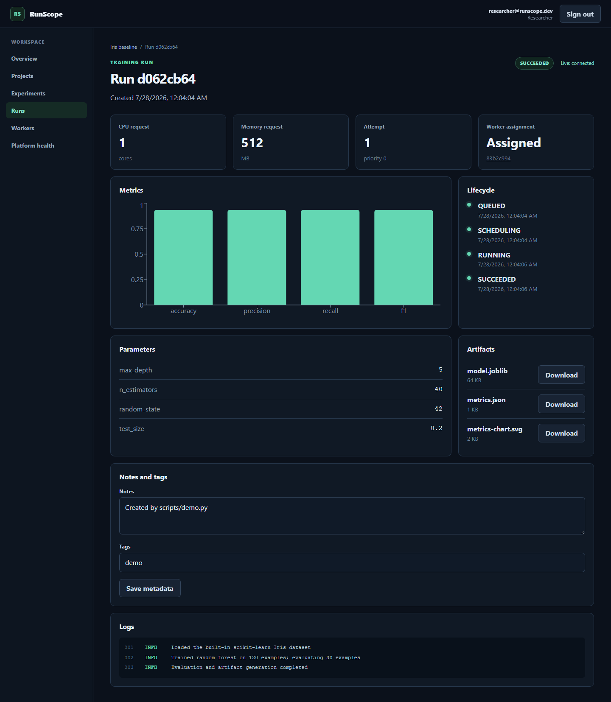
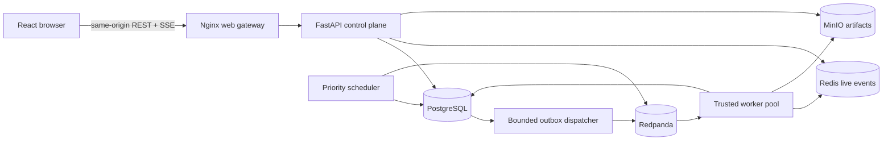
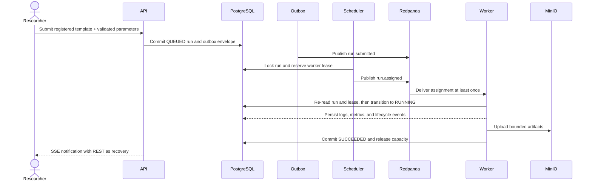
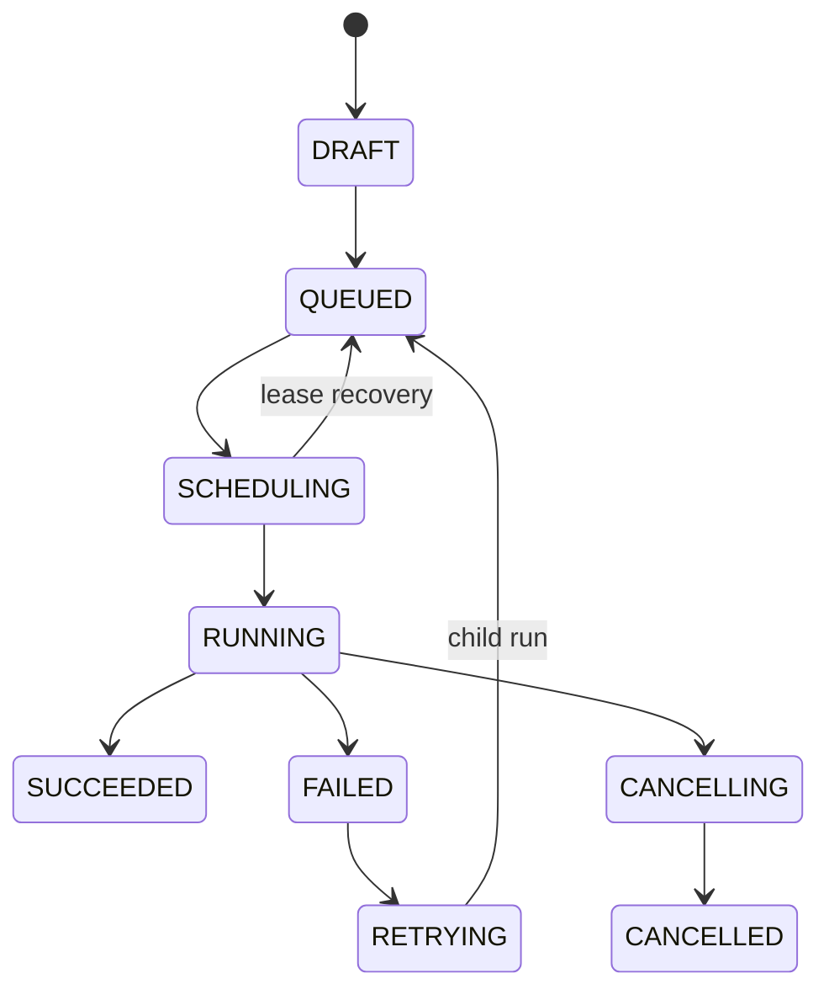
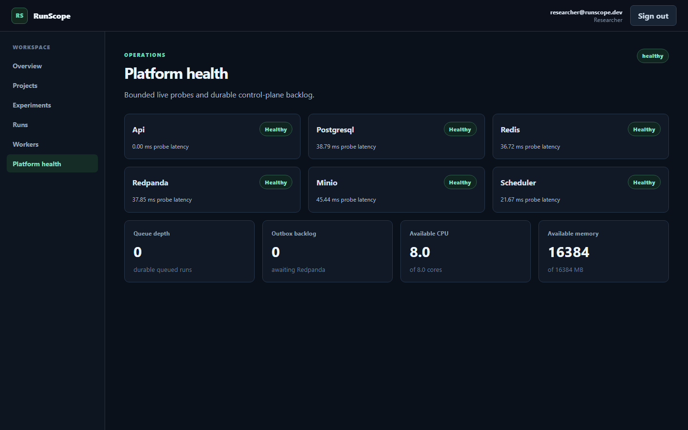

# RunScope

[](https://github.com/aditya-koganti/runscope/actions/workflows/ci.yml)
[](LICENSE)

RunScope is a self-service experiment and CPU job-management platform for small,
trusted machine-learning workloads. It demonstrates the control-plane and
execution-plane problems behind an ML platform: durable state, scheduling,
idempotent messaging, live telemetry, artifacts, cancellation, and recovery. It
does not pretend to be a production cluster manager.

The complete workflow runs locally with React, FastAPI, PostgreSQL, Redis,
Redpanda, MinIO, a separate scheduler, and two workers. RunScope never accepts
arbitrary Python, shell commands, container images, or pickle uploads.



## Video walkthrough

[Watch the 54-second captioned product walkthrough](https://github.com/aditya-koganti/runscope/releases/download/v0.1.0/runscope-demo.mp4).
It exercises the real nine-service local stack rather than a mocked interface.
The release asset is kept outside the Git history, and the recording script is
checked in for reproducibility.

## What it demonstrates

- Local JWT sign-in with viewer, researcher, and administrator roles.
- Project and experiment CRUD with search, filters, sorting, and pagination.
- A static registry of versioned, schema-validated training templates.
- Real scikit-learn Iris random-forest training in a separate worker.
- A bounded slow template for progress, cancellation, controlled failure, and
  retry lineage.
- A centralized, transactionally enforced run state machine.
- PostgreSQL outbox publication to Redpanda and idempotent consumption.
- CPU/memory-aware priority scheduling across two heartbeating workers.
- Expiring resource leases and restart reconciliation.
- Redis-backed authenticated SSE with event IDs and REST recovery.
- Durable logs, metrics, lifecycle events, notes, tags, and MinIO artifacts.
- Successful-run comparison, worker capacity, platform health, and Prometheus
  metrics.
- Non-root production images, GitHub Actions gates, Kubernetes reference
  manifests, and measured Locust smoke tests.

## Product boundary

RunScope executes only code registered in its trusted template registry. User
input is data validated by Pydantic; it cannot select modules, filesystem paths,
commands, dependencies, or images.

RunScope is not a GPU scheduler, HPC queue, distributed-training system,
autoscaler, or production multi-tenant platform. It models a deliberately small
CPU worker pool so that its persistence and reliability behavior stays visible.

## Architecture

PostgreSQL is the source of truth. Messages announce committed state; they do
not replace transactions.





The lifecycle contract is centralized and covered for every valid and invalid
state/status pair:



See [Architecture](docs/ARCHITECTURE.md),
[Data model](docs/DATA_MODEL.md), and
[Architecture decisions](docs/DECISIONS.md) for the detailed contracts and
tradeoffs.

## Technology

| Layer | Implementation |
| --- | --- |
| Web | React 19, React Router 8, TanStack Query, Recharts, Vite 7 |
| API | Python 3.12, FastAPI, Pydantic, SQLAlchemy async |
| Persistence | PostgreSQL 16, Alembic |
| Messaging | Redpanda/Kafka, versioned Pydantic envelopes, transactional outbox |
| Live updates | Redis pub/sub, authenticated streaming fetch, REST polling |
| Artifacts | MinIO through an S3-compatible `ArtifactStore` interface |
| Scheduling | Separate priority scheduler, worker heartbeats, expiring leases |
| ML | scikit-learn random forest over the built-in Iris dataset |
| Validation | pytest, mypy, Ruff, Vitest, ESLint, Playwright, Locust |
| Delivery | Docker Compose, non-root images, GitHub Actions, Kustomize |

## Quick start

Requirements:

- Docker Desktop with Compose;
- Python 3.12 and Node 22.22+ for host-side development commands;
- GNU Make is optional.

From the repository root:

```bash
docker compose up --build --detach
docker compose exec -T api alembic -c services/api/alembic.ini upgrade head
docker compose exec -T api python -m runscope_api.cli seed
```

Open:

- Web UI: `http://localhost:5173`
- OpenAPI: `http://localhost:8000/docs`
- API liveness: `http://localhost:8000/api/v1/health`
- API readiness: `http://localhost:8000/api/v1/ready`
- MinIO console: `http://localhost:9001`

The checked-in Compose values are local-only demonstration credentials.
`.env.example` documents optional overrides; keep the copied `.env` untracked.

### Demonstration accounts

These users exist only after the explicit seed command:

| Role | Email | Local-only password |
| --- | --- | --- |
| Viewer | `viewer@runscope.dev` | `ViewerDemo123!` |
| Researcher | `researcher@runscope.dev` | `ResearcherDemo123!` |
| Administrator | `admin@runscope.dev` | `AdminDemo123!` |

### Run the bounded API demo

Install development dependencies with `make setup` (or the equivalent commands
in the Makefile), then:

```bash
python scripts/demo.py
```

The script signs in as the local researcher, creates a uniquely named project
and experiment, submits the registered Iris template, follows the durable run
state with finite polling, and reports the metric/artifact counts. It never
sends code or commands.

### Common commands

| Command | Purpose |
| --- | --- |
| `make setup` | Install Python development dependencies and the locked web dependencies |
| `make dev` | Build and start the Compose stack in the foreground |
| `make stop` | Stop the Compose stack without deleting volumes |
| `make migrate` | Apply Alembic migrations |
| `make seed` | Idempotently create local demonstration users and templates |
| `make test` | Run backend and frontend unit tests |
| `make lint` | Run Python lint/types and frontend lint/types |
| `make verify` | Run supported local checks and the frontend build |
| `make verify-e2e` | Add the Chromium workflow against a running seeded stack |
| `make demo-video` | Record the real browser workflow to `demo-output/runscope-demo.webm` |
| `make screenshots` | Refresh the documented product screenshots |
| `make load-test` | Run the bounded read/SSE Locust smoke scenario |

On Windows without GNU Make, use the equivalent commands in the
[Makefile](Makefile) directly.

## Browser workflow

1. Sign in as the researcher.
2. Create a project and an experiment.
3. Select **Iris random-forest classification** and submit bounded parameters.
4. Watch the scheduler assign a worker and the live connection receive updates.
5. Inspect the lifecycle, metrics, logs, parameters, and downloadable artifacts.
6. Run **Slow progress demonstration**, cancel it, and observe the safe
   cancellation checkpoint.
7. Intentionally fail a slow run, retry it as a child run, and save notes/tags.
8. Compare two successful runs.
9. Inspect worker capacity and dependency health.



Additional captures: [sign-in](docs/assets/runscope-sign-in.png),
[overview](docs/assets/runscope-overview.png), and
[workers](docs/assets/runscope-workers.png). Recreate them against a running,
seeded stack with:

```bash
cd apps/web
npm run screenshots
```

Record a captioned walkthrough of the same real workflow with:

```bash
cd apps/web
npm run demo-video
```

The WebM output is written to the ignored `demo-output` directory. The recorder
creates uniquely named local demonstration data and covers classification,
artifacts, cancellation, retry lineage, comparison, workers, and platform
health.

## API surface

All JSON endpoints use `/api/v1`, snake_case fields, validated inputs, stable
error codes, and correlation IDs.

| Area | Representative routes |
| --- | --- |
| Identity | `POST /auth/sign-in`, `GET /auth/me` |
| Projects | `GET/POST /projects`, `GET/PATCH/DELETE /projects/{id}` |
| Experiments | `GET/POST /experiments`, `GET/PATCH/DELETE /experiments/{id}` |
| Runs | `GET/POST /runs`, cancel, retry, metadata, comparison |
| Run data | logs, metrics, events, artifacts, downloads, authenticated SSE |
| Workers | list/detail, registration, heartbeat |
| Operations | health, readiness, dependency detail, summary, Prometheus metrics |

The full behavior is documented in [API design](docs/API_DESIGN.md) and
[event contracts](docs/EVENT_CONTRACTS.md).

## Verification

The portable verification runner assumes the target Python/Node dependencies
are installed:

```bash
python scripts/verify.py
python scripts/verify.py --with-e2e  # with the seeded Compose stack running
```

The final local verification on 2026-07-28 recorded:

| Gate | Result |
| --- | --- |
| Python 3.12 | Ruff format/lint passed; strict mypy passed |
| Backend | 107 pytest tests passed |
| Frontend | ESLint and TypeScript passed; 7 Vitest tests passed |
| Build | Vite production build passed; both production images built |
| Services | Compose config passed; all 9 services started |
| Browser | 1 Chromium workflow passed in 23.7 s |
| Kubernetes | 10/10 resources passed Kubernetes 1.29 schema validation |
| Node audit | `npm audit --audit-level=high`: 0 vulnerabilities |
| Python audit | `pip-audit`: no known vulnerabilities |
| Image audit | Trivy 0.70.0: 0 HIGH/CRITICAL findings in both production images |
| Hygiene | diff/secret-pattern scans passed |

Python dependency and image scanning also run as blocking GitHub Actions jobs.

## Measured local performance

The short Docker Desktop baseline is a smoke test, not a capacity claim:

| Scenario | Load | Observations | Failures | Key result |
| --- | --- | ---: | ---: | --- |
| Read + SSE | 5 users, 30 s | 106 | 0 | aggregate p50 18 ms, p95 57 ms |
| Submit + schedule | 2 users, 20 s | 55 | 0 | assignment p50 460 ms, p95 680 ms |

The environment exposed 8 CPUs and about 3.58 GiB to the nine-service topology.
See [Performance](docs/PERFORMANCE.md) for per-route results, dataset state, and
caveats.

## Deployment references

- Docker Compose is the verified local topology.
- Production API and web images run as non-root users.
- The web image proxies `/api/` and unbuffered SSE through one browser origin.
- `infra/kubernetes` renders API, web, scheduler, a two-worker StatefulSet, and
  a migration Job; secrets and stateful services stay external.
- All ten Kubernetes resources validate against Kubernetes 1.29 schemas. No
  cluster deployment is claimed.

See [Kubernetes](docs/KUBERNETES.md) and
[Operations](docs/OPERATIONS.md).

## Design trade-offs

- PostgreSQL owns durable state; Redpanda messages announce committed changes
  and consumers treat duplicate delivery as normal.
- Static registered templates trade arbitrary extensibility for a clear,
  testable execution boundary.
- The scheduler models priority, CPU, memory, heartbeats, and leases without
  claiming operating-system isolation or production cluster semantics.
- SSE provides low-complexity live updates, while REST remains the recovery path
  after disconnects or missed ephemeral events.
- Compose favors a reproducible local demonstration over high availability; the
  Kubernetes manifests keep stateful service operations external.

## Future improvements

- Replace local JWT identity with OIDC, short-lived session renewal, and managed
  secrets.
- Add tenant isolation, TLS, network policy, audit export, backups, and
  high-availability stateful dependencies before any untrusted deployment.
- Add scheduler fairness, quotas, preemption, and autoscaling only with matching
  durable contracts and failure tests.
- Split large frontend routes to reduce the current production bundle.
- Add longer soak and recovery tests across process and dependency restarts.

See [Architecture decisions](docs/DECISIONS.md) and
[Limitations](docs/LIMITATIONS.md) for the detailed rationale and boundaries.

## Repository map

```text
apps/web/                 React UI, Vitest, Playwright, screenshot utility
services/api/             FastAPI control plane, models, migrations, templates
services/scheduler/       Priority scheduling, leases, reconciliation
services/worker/          Registered-template execution and durable completion
packages/contracts/       Versioned event and live-update envelopes
infra/docker/             Development and non-root production images
infra/kubernetes/         Kustomize reference deployment
scripts/                  Bounded demo and verification runners
tests/load/               Read/SSE and opt-in mutation Locust scenarios
docs/                     Product, architecture, security, operations, evidence
```

## Security and limitations

Passwords are Argon2-hashed, access tokens are short-lived, authorization is
enforced server-side, public 500 responses are stable, logs redact sensitive
keys, storage retries are finite, and message consumers assume duplicate
delivery.

This remains a local educational system. It does not provide OIDC/SSO, MFA,
tenant isolation, TLS, network policy, HA dependencies, backups, quotas,
autoscaling, preemption, fairness, malware controls, or a production security
review. The frontend keeps its access token in memory, and the demo passwords
must never be reused outside an isolated local environment.

See [Security](docs/SECURITY.md) and [Limitations](docs/LIMITATIONS.md).

## Documentation

- [Product requirements](docs/PRODUCT_REQUIREMENTS.md)
- [Architecture](docs/ARCHITECTURE.md)
- [Data model and lifecycle](docs/DATA_MODEL.md)
- [API design](docs/API_DESIGN.md)
- [Event contracts](docs/EVENT_CONTRACTS.md)
- [Test strategy and verification evidence](docs/TEST_STRATEGY.md)
- [Operations](docs/OPERATIONS.md)
- [Performance](docs/PERFORMANCE.md)
- [Security](docs/SECURITY.md)
- [Kubernetes reference](docs/KUBERNETES.md)
- [Architecture decisions](docs/DECISIONS.md)
- [Implementation phases](docs/IMPLEMENTATION_PLAN.md)

## License

RunScope is available under the [MIT License](LICENSE).
