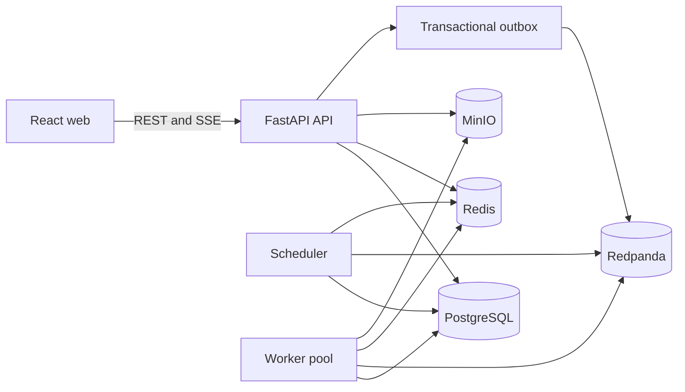

# Architecture

## Context

RunScope separates an HTTP control plane from resource scheduling and trusted
execution. PostgreSQL is the source of truth. Messages notify services of durable
state changes; they do not replace database transactions.



## Services

- **Web:** React/Vite application, route protection, query cache, forms, tables,
  charts, permission-aware controls, and SSE reconnect/deduplication.
- **API:** authentication, authorization, CRUD, run commands and reads, artifact
  downloads, health/readiness, SSE, and Prometheus metrics.
- **Scheduler:** polls queued runs, locks candidates, selects a healthy worker,
  creates a resource lease transactionally, and publishes assignment events.
- **Worker:** registers and heartbeats, consumes assignments, verifies durable
  state and lease ownership, executes a registry entry, persists telemetry,
  uploads artifacts, and releases capacity.

## Infrastructure abstractions

- `Broker` exposes publish/consume over Kafka-compatible implementations.
- `ArtifactStore` exposes put/get/delete/presign over local and S3-compatible
  implementations.
- `LiveEventBus` exposes publish/subscribe with Redis and in-process test
  implementations.
- Time and identifier generation are injectable at stateful boundaries.

## Source of truth and delivery

PostgreSQL owns users, projects, experiments, run state, assignments, capacity,
logs, metrics, artifacts, and run events. Broker delivery is at least once.
Consumers use event IDs and state preconditions to make repeat delivery safe.
An outbox-style publisher is preferred for state changes that must result in a
message; a direct publisher is permitted only where reconciliation closes the
failure window and the decision is documented.

## Run execution sequence

```mermaid
sequenceDiagram
    participant U as Researcher
    participant A as API
    participant D as PostgreSQL
    participant X as Outbox dispatcher
    participant S as Scheduler
    participant B as Redpanda
    participant W as Worker
    participant O as MinIO
    U->>A: Submit validated run
    A->>D: Commit QUEUED run and outbox envelope
    X->>D: Read unpublished envelope
    X->>B: Publish run.submitted with bounded retries
    S->>D: Lock queued run and allocate lease
    S->>B: run.assigned
    B->>W: Assignment
    W->>D: Verify lease; transition RUNNING
    W-->>D: Logs and metrics
    W->>O: Upload artifacts
    W->>D: Transition SUCCEEDED and release lease
    A-->>U: SSE updates and REST reads
```

## Deployment topology

Docker Compose is the primary development topology and supplies local-only
PostgreSQL, Redis, Redpanda, and MinIO services. Kubernetes manifests model
separate web, API, scheduler, worker, and migration workloads, reference
externalized secrets, and deliberately leave stateful dependencies to the
operator.
