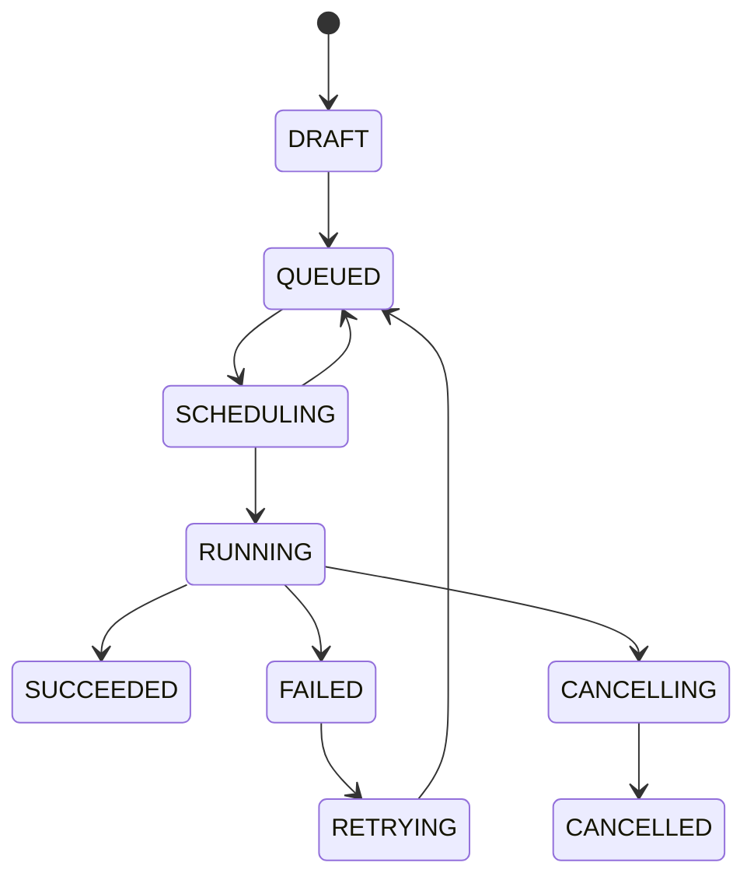

# Data Model

## Conventions

Primary keys are UUIDs. Timestamps are timezone-aware UTC. Mutable rows include
`updated_at`; run transitions also increment an integer `version`. JSON values
are validated through application contracts before persistence.

## Entities

| Entity | Purpose and important constraints |
| --- | --- |
| User | Unique normalized email, Argon2/bcrypt password hash, role enum. |
| Project | Name and description; FK `created_by`; indexed by creator and name. |
| Experiment | Belongs to project; unique name per project; JSON tags; creator FK. |
| TrainingTemplate | Unique `(key, version)`; JSON parameter schema; enabled flag. |
| Run | Experiment/template/creator FKs; state, priority, resources, parent retry, assignment, timestamps, failure, notes/tags, optimistic `version`. |
| RunParameter | Unique `(run_id, name)`; JSON value. |
| RunMetric | Indexed `(run_id, name, step)` and `(run_id, recorded_at)`. |
| RunLog | Unique `(run_id, sequence_number)` for idempotent ordered logs. |
| Artifact | Unique `(run_id, name)`; storage key, media type, size, checksum. |
| RunEvent | Ordered audit/timeline record; event type and state change metadata. |
| Worker | Unique name; status/capacity/counters/last heartbeat. |
| ResourceAllocation | One active lease per run; unique lease token; worker/run FKs. |
| ProcessedMessage | Event ID plus consumer name for durable idempotency. |
| OutboxMessage | Versioned event envelope awaiting broker publication. |

The last two tables support delivery correctness and are the only additions to
the required domain model. They keep idempotency and publication state durable
rather than process-local.

## Relationships and deletion

- A project cannot be deleted while experiments exist; the API returns conflict.
- An experiment cannot be deleted while runs exist.
- Run-owned telemetry and parameters cascade on run deletion, but ordinary API
  behavior does not delete runs.
- Users, templates, workers, and parent runs use restrictive or nullifying
  deletion behavior appropriate to audit preservation.
- Releasing an allocation sets `released_at`; historical allocations remain.

## Run state machine

Terminal states are `SUCCEEDED` and `CANCELLED`. `FAILED` is stable but may begin
the explicit retry transition. Every accepted transition validates the previous
state, uses a transaction, increments `version`, and writes a `RunEvent`. Invalid
or stale transitions fail with a structured conflict.

